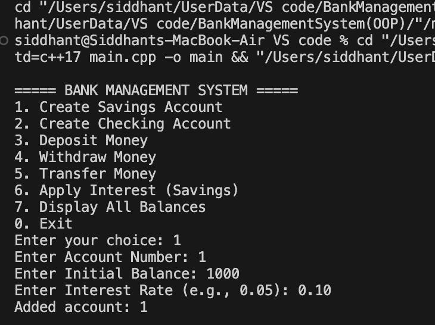
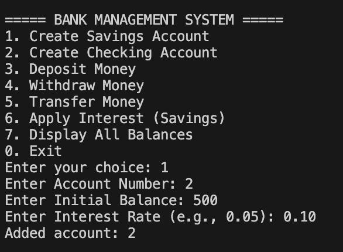
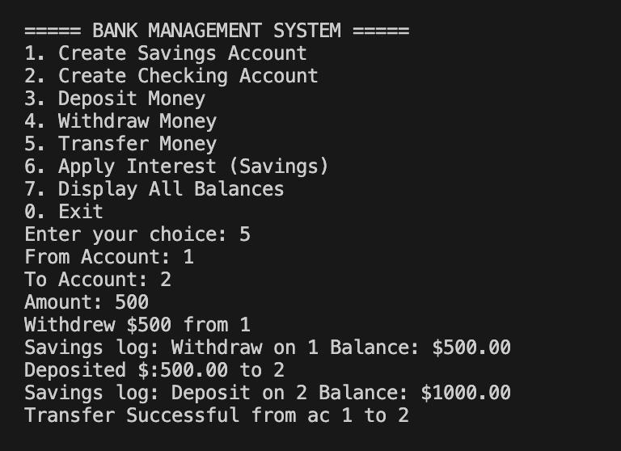
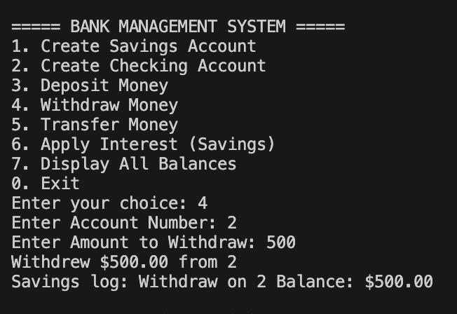
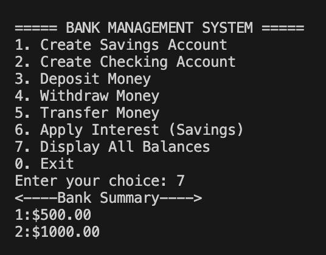

# 🏦 Bank Management System  
### *(Object-Oriented Programming in C++)*

A clean, **object-oriented Bank Management System** built using **C++**, designed to model real-world banking operations by applying core **OOP principles** such as:

- Encapsulation  
- Abstraction  
- Inheritance  
- Polymorphism  

This project is ideal for **learning OOP**, **academic submissions**, and **portfolio showcasing**.

---

## ✨ Features

✔ Create new bank accounts  
✔ Display account details  
✔ Deposit money  
✔ Withdraw money  
✔ Transfer money between accounts  
✔ View all accounts summary  
✔ Simple and intuitive **text-based UI**

---

## 🧠 Core Concepts Used

- **Object-Oriented Programming (OOP)**
- **Class Design & Encapsulation**
- **Inheritance & Function Overloading**
- **Modular Code Structure**
- **Menu-Driven Console Application**

---

## 🗂️ Table of Contents

- 📸 Demo / Screenshots  
- 🚀 Getting Started  
- 🛠️ Installation  
- 🧾 Usage  
- 🧪 Examples  
- 🤝 Contributing  
- 🙌 Credits  

---

## 📸 Demo / Screenshots

> All screenshots are displayed in a **uniform size** for a clean and professional look.

<p align="center">
  
  <br><em>First Account Creation</em>
</p>

<p align="center">
  
  <br><em>Second Account Creation</em>
</p>

<p align="center">
  
  <br><em>Money Transfer (Account 1 → Account 2)</em>
</p>

<p align="center">
  
  <br><em>Withdrawal Operation</em>
</p>

<p align="center">
  
  <br><em>Displaying All Bank Accounts</em>
</p>

---

## 🚀 Getting Started

Follow the steps below to run the project on your local machine.

---

## 🛠️ Installation

### Clone the Repository
```bash
git clone https://github.com/siddhantpawbake/BankManagementSystem-OOP-.git
cd BankManagementSystem-OOP-
```
### Compile & Run

Compile the program (GCC):

    g++ main.cpp -o BankSystem

Run the application:

    ./BankSystem

💡 You can also run this project using VS Code, CLion, or Code::Blocks.

---

## 🧾 Usage

After launching, the following menu is displayed:

    1. Create Account
    2. Deposit Amount
    3. Withdraw Amount
    4. Balance Enquiry
    5. All Account Holders List
    6. Close An Account
    7. Modify An Account
    8. Exit

👉 Enter the corresponding number to perform an operation.

---

## 🧪 Examples

Create an account:

    Enter Name: John Doe
    Enter Balance: 5000
    Account created successfully!

Deposit money:

    Enter Account No: 1001
    Enter Deposit Amount: 2000
    Updated Balance: 7000

---

## 🤝 Contributing

Contributions are welcome and appreciated!

You can:
- ✨ Add new features
- 🐛 Fix bugs
- 📝 Improve documentation

Steps:
1. Fork the repository
2. Create a new branch
3. Commit your changes
4. Open a Pull Request

---

## 🙌 Credits

Made with 💛 by Siddhant Pawbake

⭐ If you found this project useful, consider giving it a star!
